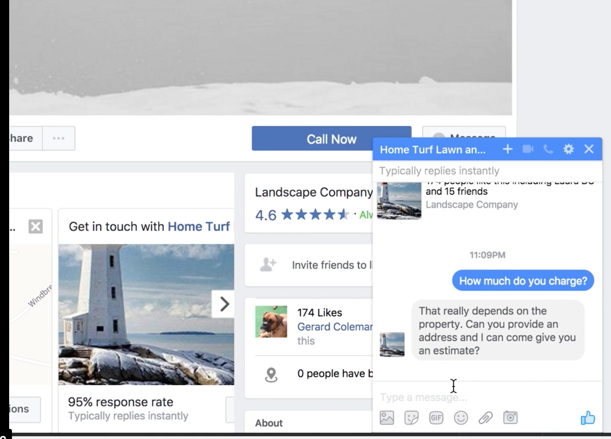

<h1>Facebook Chat Bot using API.AI</h1>

This Facebook ChatBot uses Node.js and API.ai integration for conversational AI through FB Messenger.

<ul>
	<li>Uses Heroku environment variables. you will need to set these.</li>
	<li><b>npm install</b> after clone</li>
	<li><b>deploy to heroku</b></li>
	<li>or run localy via <b>npm start</b></li>
</ul>

